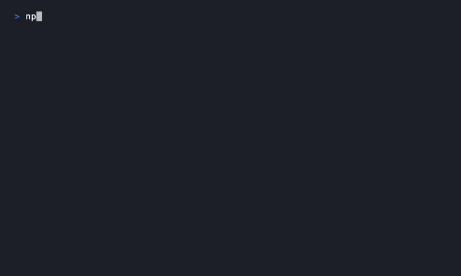

# Foundry

[](https://github.com/PolinaTymchenko/foundry/actions/workflows/ci.yml)
[](./LICENSE)
[](package.json)

Foundry scaffolds a React design system: components, tokens, Storybook, and
CI, wired together from the first commit. `foundry generate` keeps it growing
after that.

It's not a copy-paste starter and not a themeable UI kit. It's meant for
platform teams standing up the component library their own product teams will
build on.



**Status: v0.1, pre-publish.** Everything below has been run against a fresh
scaffold; see [Verifying this yourself](#verifying-this-yourself). The three
packages this repo produces aren't on the npm registry yet, so `npm install`
won't work from outside this repo until that changes. See
[Publishing status](#publishing-status).

## Table of contents

- [Philosophy](#philosophy)
- [Quick start](#quick-start)
- [What you get](#what-you-get)
- [Generating components](#generating-components)
- [Storybook](#storybook)
- [Testing](#testing)
- [Publishing your component library](#publishing-your-component-library)
- [Architecture](#architecture)
- [Project status](#project-status)
- [Publishing status](#publishing-status)
- [Contributing](#contributing)
- [License](#license)

## Philosophy

**Platform teams, not side projects.** The target user is someone on an
internal platform or design-systems team asked to build "the" component
library their org will depend on. That needs to hold up over hundreds of
components and years of changes, not just look good in a demo.

**A dependency, not a template.** `create-react-foundry` doesn't hand you a
snapshot to maintain alone. `@foundryui/cli` stays installed, so
`foundry generate component` works the same on day 900 as on day one.
Conventions live in one place (`docs/adr/` in this repo) and the generator
enforces them, instead of each new component drifting from the last.

**Zero-runtime styling.** Components use CSS Modules against plain CSS custom
properties for tokens. No CSS-in-JS runtime computing styles on every render.
At the scale Foundry targets, that's a performance and bundle-size decision,
not a preference.

**Accessibility is enforced, not suggested.** Every generated component ships
with `eslint-plugin-jsx-a11y` at write time and an automated axe scan (via
Storybook's test runner) at test time. Checked in Foundry's own CI at every
milestone, not configured once and assumed to keep working.

**AI-native is a long-term bet.** Foundry's conventions are explicit and
machine-checkable: ADRs, one registered template shape per artifact type, a
consistent barrel-export contract. The point is that a coding agent can extend
a Foundry project as reliably as a person can. Today that means a CLI; the
mechanism doesn't assume a human is the one typing.

## Quick start

```bash
npm create react-foundry@latest my-design-system
cd my-design-system
pnpm dev
```

This scaffolds a monorepo with design tokens, a `Button` and an `Input`, a
Storybook instance, and CI, then starts Storybook with both components:
variants, sizes, loading and disabled states, controlled and uncontrolled form
behavior, and a passing accessibility check.

You'll be asked three questions (or skip them with flags, below):

| Prompt | What it controls | Default |
| --- | --- | --- |
| Project name | Directory name and root package name | `my-design-system` |
| Package scope | Publishes as `{scope}/react`, `{scope}/tokens` | `@` + first word of the project name |
| Initialize a git repository? | Runs `git init` after scaffolding | Yes |

Non-interactive, for scripts or CI:

```bash
npm create react-foundry@latest my-design-system -- \
  --package-scope=@acme \
  --token-prefix=acme \
  --license=mit
```

- `--package-scope=<@scope>`: npm scope the generated packages publish under.
  Defaults to `@` + the first hyphen-separated word of the project name.
- `--token-prefix=<prefix>`: CSS custom property prefix for design tokens
  (`--{prefix}-color-...`). Defaults to `fd`. Lowercase letters, numbers, and
  hyphens, starting with a letter.
- `--license=<apache-2.0|mit>`: license for the generated project. Defaults to
  `apache-2.0`.

## What you get

- **Design tokens** as plain CSS custom properties (`packages/tokens`): color,
  spacing, and typography scales, prefixed and ready to extend.
- **`Button` and `Input`** (`packages/react`): forwardRef, keyboard and
  screen-reader behavior, controlled/uncontrolled form state via a shared
  `useControlledState` hook, variants and sizes as style axes.
- **Storybook** (`apps/storybook`), loading every `*.stories.tsx` in
  `packages/react` automatically. Nothing to register by hand.
- **An accessibility gate**: `eslint-plugin-jsx-a11y` at write time, a live
  axe scan via Storybook's test runner at test time.
- **Vitest + React Testing Library**, passing from the first commit.
- **CI** (GitHub Actions) running lint, typecheck, build, test, and format
  checks on every push and pull request, via Turborepo.
- **`foundry generate`**: the command for every component after the first
  two.

## Generating components

From inside a scaffolded project:

```bash
pnpm generate component Card
```

You'll be asked for a category (Atom, Molecule, Organism, or Template). This
groups the component in Storybook's sidebar; it doesn't change the generated
code. Skip the prompt with a flag:

```bash
pnpm generate component Card --category=molecule
```

Either way, this creates `packages/react/src/Card/`:

```
Card/
├── Card.tsx          # forwardRef, follows docs/adr conventions
├── Card.module.css   # scoped styles against your project's tokens
├── Card.stories.tsx  # auto-discovered by Storybook
├── Card.test.tsx     # Vitest + Testing Library, ready to extend
└── index.ts
```

...and updates `packages/react/src/index.ts` so the new component is exported
right away, with nothing to register by hand.

If Storybook is already running (`pnpm dev` in another terminal) when you
generate a component, restart it (`Ctrl+C`, then `pnpm dev` again). Storybook's
dev server picks up new story files reliably on a fresh start, but hot reload
alone can leave a just-added story showing an `importers[path] is not a
function` error until you do. This is a Storybook/Vite dev-server limitation
with newly created files, not specific to Foundry — confirmed by reproducing
it and checking that a restart clears it.

## Storybook

```bash
pnpm dev     # starts Storybook at http://localhost:6006
pnpm build   # static build to apps/storybook/dist
```

The accessibility gate runs against a live Storybook instance:

```bash
pnpm dev                                      # in one terminal
pnpm --filter @acme/storybook test:a11y       # in another, once it's up
```

(Substitute your project's actual package scope for `@acme`.) This runs
`@storybook/test-runner` with `axe-playwright` against every story: a
browser-driven accessibility scan, not a static lint rule.

## Testing

```bash
pnpm test           # Vitest + React Testing Library, every package
pnpm lint           # ESLint, including eslint-plugin-jsx-a11y
pnpm typecheck      # tsc --noEmit, every package
pnpm format:check   # Biome
```

All four run per-package via Turborepo, cached on content hashes, so repeat
runs against unchanged code are close to instant. `pnpm test` covers
component behavior and the shared `useControlledState`/accessibility
utilities. The Storybook a11y gate above is a separate, browser-driven check;
neither replaces the other.

## Publishing your component library

`packages/react` and `packages/tokens` are publishable npm packages from the
moment they're scaffolded. Nothing else to configure:

```bash
pnpm build
cd packages/react   # or packages/tokens
npm publish --access public   # omit --access public for a private registry/scope
```

Before your first publish:

- The package scope you chose during scaffolding (`--package-scope`, e.g.
  `@acme`) needs to be an npm user or organization you own. Foundry names the
  packages `{scope}/react` and `{scope}/tokens`; it doesn't create the scope
  on npm's side.
- You'll need to be logged in (`npm login`) or have `NODE_AUTH_TOKEN` set in
  CI, same as publishing any npm package.
- v0.1 doesn't set up an automated release pipeline (changesets, versioning,
  a release workflow) inside generated projects. That's a deliberate scope
  decision, not an oversight — see [Project status](#project-status). Until
  you build one, the manual flow above is what you have.
- For a private or internal registry, set `publishConfig.registry` in the
  package's `package.json`, or point `.npmrc` at it. Standard npm behavior,
  nothing Foundry-specific.

## Architecture

Two layers: a framework-agnostic generator engine, and two CLIs built on it.

| Package | npm name | Purpose |
| --- | --- | --- |
| `packages/generator-core` | `@foundryui/generator-core` | Framework-agnostic engine: prompts, `{{variable}}` template rendering, lifecycle hooks. Knows nothing about "projects" or "components." |
| `packages/create-react-foundry` | `create-react-foundry` | `npm create react-foundry`. Scaffolds a new project, once. |
| `packages/cli` | `@foundryui/cli` (bin `foundry`) | `foundry generate ...`. The CLI a scaffolded project depends on afterward. |

Neither CLI reimplements prompt handling or template rendering; both are
built on `generator-core`. A dependency-cruiser rule (`pnpm lint:deps`)
enforces that `generator-core` never imports from either of its consumers.
That boundary fails the build if violated, rather than relying on convention.

A scaffolded project follows the same split: `packages/react` and
`packages/tokens` are the component library, `apps/storybook` documents it,
and `docs/adr/` (in this repo, not copied into scaffolded projects) is where
the conventions the generator encodes are written down.

## Project status

**Implemented and verified in v0.1:**

- Project scaffolding (`create-react-foundry`) and in-project component
  generation (`foundry generate component`)
- A starting component library: tokens, `Button`, `Input`, Storybook, a
  passing accessibility gate
- Full CI (lint, typecheck, build, test, format) on every generated project

**Not in v0.1**, each descoped deliberately:

- **A generated documentation site** (auto-discovered component pages with
  props tables, live playgrounds, copyable code). You get Storybook today,
  not this. Planned for a later milestone.
- **A token compiler or Style Dictionary-style pipeline.** Tokens are
  hand-authored CSS custom properties for now, kept minimal rather than
  building token infrastructure ahead of a proven need.
- **Codemods and a formal deprecation-window process** for breaking changes
  to generated code. The intended direction, not yet built.
- **Multi-tool AI assistant configuration** (Cursor rules, Copilot
  instructions, etc.) scaffolded into generated projects. Designed, not yet
  a shipped generator feature.
- **More artifact types** beyond `component` (hooks, providers, routes,
  tokens). The registry (`packages/cli/src/generators/index.ts`) is built to
  add these without new architecture; none are registered yet.

## Publishing status

None of the three packages this repo produces (`@foundryui/generator-core`,
`create-react-foundry`, `@foundryui/cli`) are on the public npm registry
yet, checked directly against the registry while preparing this release.
Every command in this README has been run against a real scaffold using
local builds (below); what's missing is the first `npm publish`.

### Verifying this yourself

Every command block in this README was run against a real, freshly scaffolded
project before being written down. Since the packages aren't published yet,
verification uses local builds instead of the registry:

```bash
pnpm install && pnpm build   # from this repo's root

# then, in a scratch directory:
node path/to/foundry/packages/create-react-foundry/dist/index.js my-app
```

A freshly scaffolded project's `pnpm install` will fail on `@foundryui/cli`
until it's published. For local verification, add a `pnpm.overrides` entry
pointing at your local build (`"@foundryui/cli": "link:/path/to/foundry/packages/cli"`,
same for `@foundryui/generator-core`) before installing. This is a
verification workaround, not something to commit to a real project.

## Contributing

See [CONTRIBUTING.md](./CONTRIBUTING.md) for development setup, the
repository structure, and how releases work.

## License

Apache-2.0. See [LICENSE](./LICENSE).
